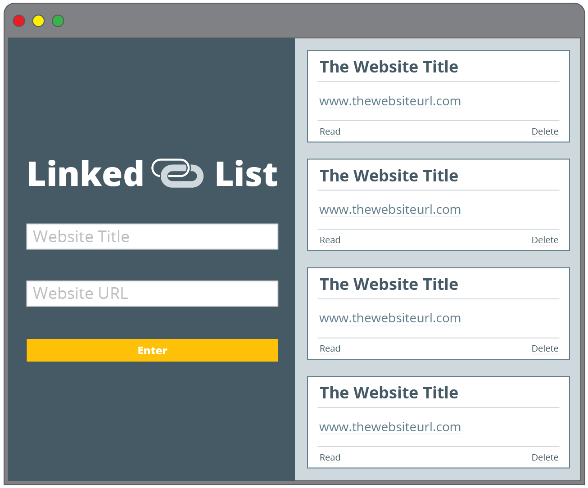

# linked-list

# The project:
1. Step one: Make the site
  *Two input fields
  *One for the title of the bookmark
  *One for the URL that the bookmark should link to
  *One button for creating the bookmark and adding it to the page
  *A section for all of the created bookmarks; each bookmark should display:
  *The title of the bookmark
  *The URL of the bookmark (this should be clickable and link to the URL)
  *A button to “Mark as Read”
  *A button to “Remove” the bookmark

# Original Comp

#Our Version

