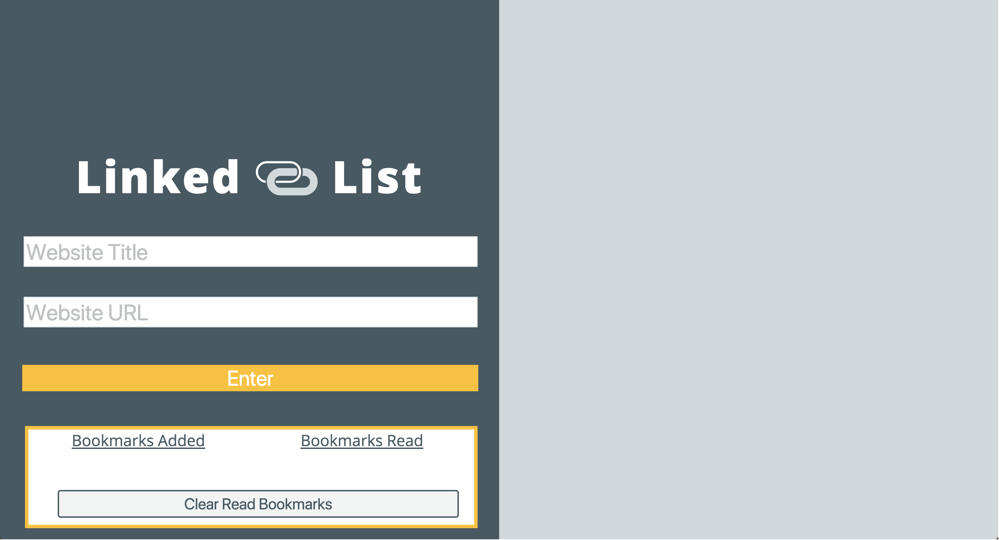

# linked-list

## The project:
1.Make the site
  * Two input fields
  * One for the title of the bookmark
  * One for the URL that the bookmark should link to
  * One button for creating the bookmark and adding it to the page
  * A section for all of the created bookmarks; each bookmark should display:
    * The title of the bookmark
    * The URL of the bookmark (this should be clickable and link to the URL)
    * A button to “Mark as Read”
    * A button to “Remove” the bookmark
2. Basic Functionality
  * The user should be able to input a title and URL into the appropriate fields
  * When the user clicks on the button for creating the bookmark, it should be added to the bookmarks section
  * When the user clicks on the “Mark as Read” button:
  * A class of .read should be added to the bookmark
  * If it already has the class of .read, it should be removed
  * When the user clicks on the “Remove” button, the link should be removed from the page
3. 

# Original Comp

#Our Version

